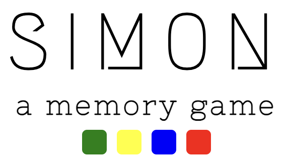
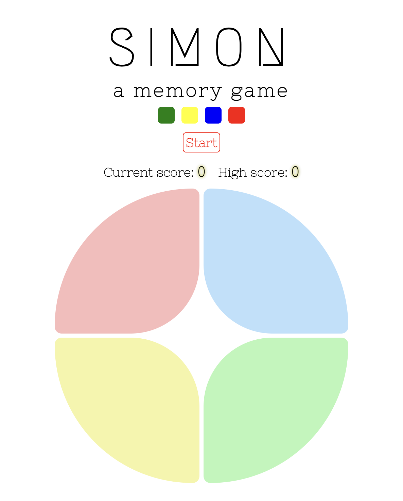
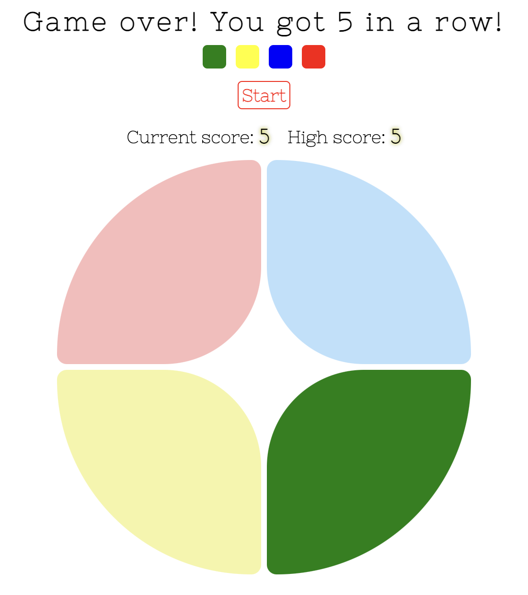

<!-- PROJECT LOGO -->
 

<h2 align="center">
    <a href="https://caseystell.github.io/project-1-simon-game/" target="_blank" rel="noopener noreferrer" >Simon: A Memory Game</a>
</h2>

  

    This memory game tests a player's ability to remember an ever-growing sequence of colors while using a clean, minimal interface. Enjoy testing the limits of your memory with this easy and fun game for ages 4+!
  

<!-- TABLE OF CONTENTS -->

  
Table of Contents

  <ol>
    <li>
      <a href="#about-the-project">About The Project</a>
      <ul>
        <li><a href="#game-images">Game Images</a></li>
        <li><a href="#built-with">Built With</a></li>
      </ul>
    </li>
    <li><a href="#getting-started">Getting Started</a></li>
    <li><a href="#next-steps">Next Steps</li>
  </ol>

## About The Project

In this elevated memory game, players try to mimic the generated color sequence for as long as they can! A new random color is added to the end of each sequence, making the pattern to remember longer and longer. Can you beat your previous high score and remember your longest sequence yet?

(<a href="#readme-top">back to top</a>)

## Game Images

(<a href="#readme-top">back to top</a>)

## Built With

* HTML
* CSS
* Javascript

(<a href="#readme-top">back to top</a>)

## Getting Started

<h4>How to Play:</h4>
<h5>Click <a href="https://caseystell.github.io/project-1-simon-game/" target="_blank" rel="noopener noreferrer" >here</a> to launch the game!</h5>
<ol>
    <li>Click "Start"!</li>
    <li>A color will flash. Repeat the sequence by clicking on the same color tile.</li>
    <li>The game will continue. After each color sequence that you repeat successfully, another color will be added to the end.</li>
    <li>When you don’t complete a sequence successfully, the game will end by displaying your score and the "Start" button to try again. Try to beat your high score!</li>
</ol>

(<a href="#readme-top">back to top</a>)

## Next Steps

<h4>In future versions, we hope to roll out the following features:</h4>
<ul>
    <li>Customizable sounds and colors/patterns for each tile!</li>
    <li>Easy, Medium, and Hard levels with an increasing number of tiles beyond 4 to enhance your skills</li>
    <li>The option to create an account to see other users' high scores, and for a chance to get a spot on the High Score Scoreboard</li>
</ul>

(<a href="#readme-top">back to top</a>)

